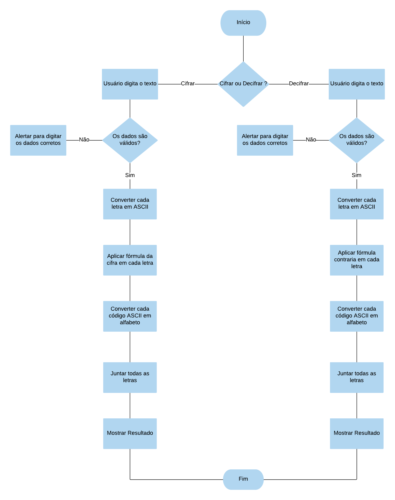

1. Se o usuário quiser cifrar a mensagem, ao clicar no botão, irá começar a função cipher().
2. A variável string receberá o texto digitado pelo usuário.
3. As variáveis array, arrayCipher e arrayResult recebem arrays vazios.
4. Uma condicional vai comparar se a variavel string é maiúscula. 
5. Se a variável string for maiúscula, um loop declara que i é igual a 0, enquanto i for menor que o tamanho da string, o i recebe mais um. 
6. A variável array com a posição do valor de i, vai receber o resultado da função charCodeAt com parâmetro i. A variável arrayCipher de indice i vai receber o resultado da fórmula: array posição i - 65 + 33, módulo 26 + 65. 
7. A variável arrayResult receberá o resultado da função fromCharCode com o parâmetro arrayCipher.
8. Se a variável string for minúscula, um novo loop declara que i é igual a 0, enquanto i for menor que o tamanho da string, o i recebe mais um. 
9. A variável array com a posição do valor de i, vai receber o resultado da função charCodeAt com parâmetro i. A variável arrayCipher de indice i vai receber o resultado da fórmula: array posição i - 97 + 33, módulo 26 + 97. 
10. A variável arrayResult receberá o resultado da função fromCharCode com o parâmetro arrayCipher.
11. Para passar de array para string, a variável resultCipher receberá o resultado da função join de arrayResult. 
12. No html, a div result irá mostrar o valor da variável resultCipher.
13. Se o usuário quiser decifrar a mensagem, ao clicar no botão, irá começar a função decipher().
14. A variável string receberá o texto digitado pelo usuário.
15. As variáveis array, arrayDecipher e arrayResult recebem arrays vazios.
16. Uma condicional vai comparar se a variavel string é maiúscula. 
17. Se a variável string for maiúscula, um loop declara que i é igual a 0, enquanto i for menor que o tamanho da string, o i recebe mais um. 
18. A variável array com a posição do valor de i, vai receber o resultado da função charCodeAt com parâmetro i. 
19. A variável arrayDecipher de indice i vai receber o resultado da fórmula: array posição i + 65 - 33, módulo 26 + 65. 
20. A variável arrayResult receberá o resultado da função fromCharCode com o parâmetro arrayDecipher.
21. Se a variável string for minúscula, um novo loop declara que i é igual a 0, enquanto i for menor que o tamanho da string, o i recebe mais um. 
22. A variável array com a posição do valor de i, vai receber o resultado da função charCodeAt com parâmetro i. A variável arrayCipher de indice i vai receber o resultado da fórmula: array posição i - 97 + 33, módulo 26 + 97. 
23. A variável arrayResult receberá o resultado da função fromCharCode com o parâmetro arrayDecipher.
24. Para passar de array para string, a variável resultdeCipher receberá o resultado da função join.
25. No html, a div result irá mostrar o valor da variável resultDecipher.

 
